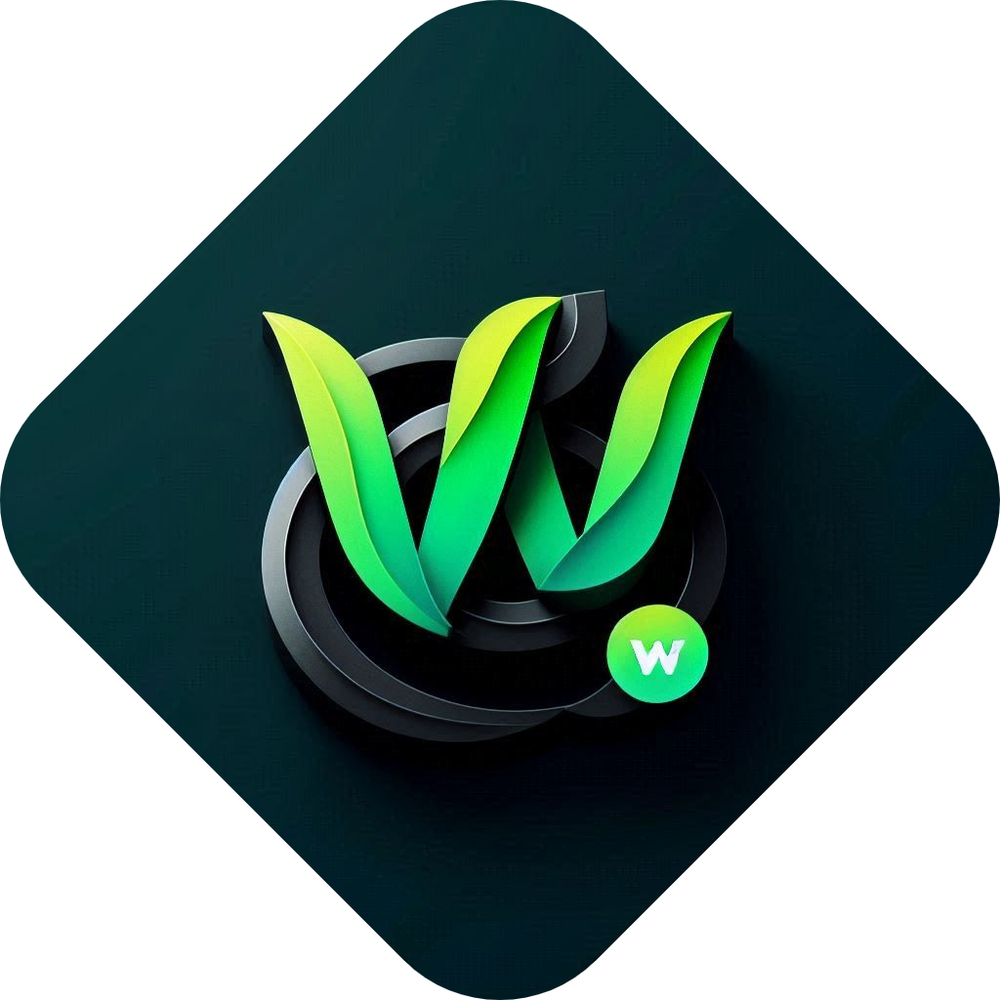

  

<h1 align="center">WP (API) | Rust | Extra-Mini</h1>

  Extra-Minimal API Wrapper for WattDownload Apps

---

## What is this?
- The extra minimal api wrapper of `wp` used in WattDownload apps.

## Disclaimer
> [!WARNING]
> Using this api wrapper may violate Wattpad's [Terms of Service](https://policies.wattpad.com/terms/). These tools are provided for educational and personal backup purposes only. **USE AT YOUR OWN RISK.**

## Features

## Get started
- Just reach [wp-epub-mini](../wp-epub-mini) repo and figure our yourself - at least for now.

## Acknowledgements
- [AaronBenDaniel](https://github.com/AaronBenDaniel) for maintaining [API Documentation](https://github.com/Archive-WP/WattpadAPIDocumentation/), and always helping with strict-robust testing, giving ideas, debugging, and inspiring..
- [TheOnlyWayUp](https://github.com/TheOnlyWayUp) for crate [wattpad_rs](https://crates.io/crates/wattpad-rs)

---

> [!NOTE]
> `Wattpad` is a registered trademark of `Wattpad` & `Webtoon Entertainment Inc.`. This project is not affiliated with, endorsed, or sponsored by Wattpad.

© 2025 WattDownload.

